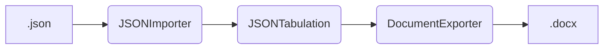

# JSON to DOCX tabulator

### **Input** : JSON file
Input is a simple JSON file

### **Output** : DOCX file
Output consists of a DOCX file with a tabulated JSON

# JSON To Document Converter
This is the main wrapper class that handles the full operation. A JSON file is directly converted to DOCX file by this class. Internally three objects handle the three parts of the operation Import, Process and export.

Code follows the following flow

### JSON Importer
This class is resposible for importing the JSON file

### JSON Tabulation
This class is resposible for processing the JSON data and converting it into a document

### Document Exporter
This class is resposible exporting the data into the file document.

